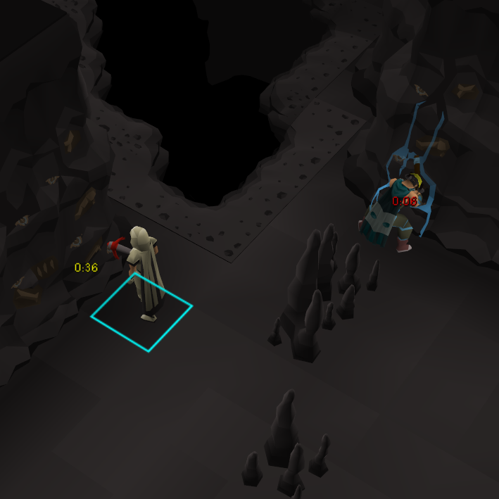

# Calcified Rock Despawn Timer

Shows an estimate of the remaining time before a calcified rock despawns.

## Features

- Timer display modes: pie timer, tick counter, or minutes:seconds.
- Shows a 70 second timer when a calcified rock starts being mined
- Shows a 30 second timer when a waterstream appears on a calcified rock
- UI customization for colors and size.

## Credits

Based on [Tree despawn timer](https://github.com/CreativeTechGuy/tree-despawn-timer/) plugin by CreativeTechGuy
